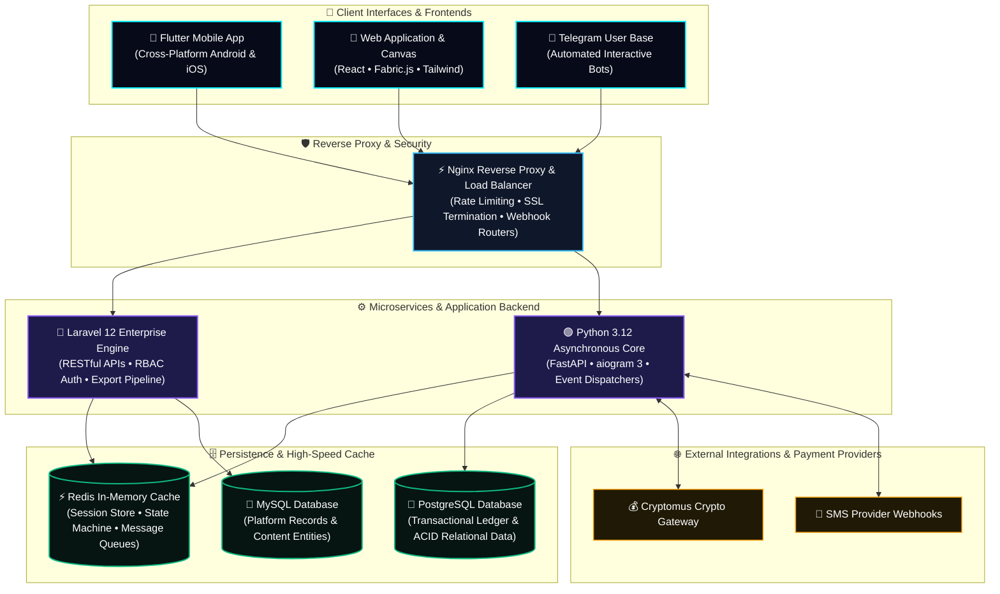
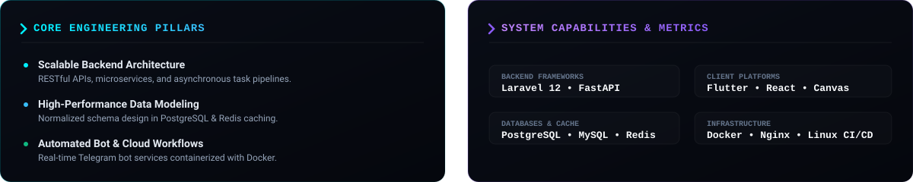
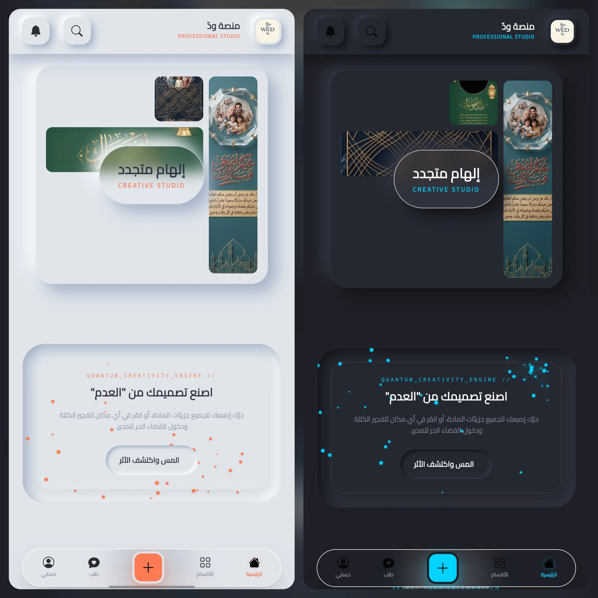
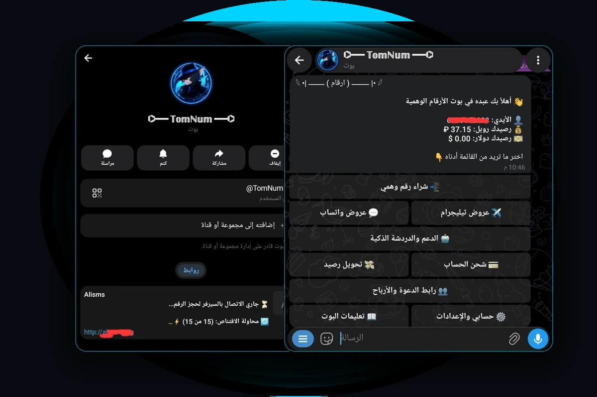
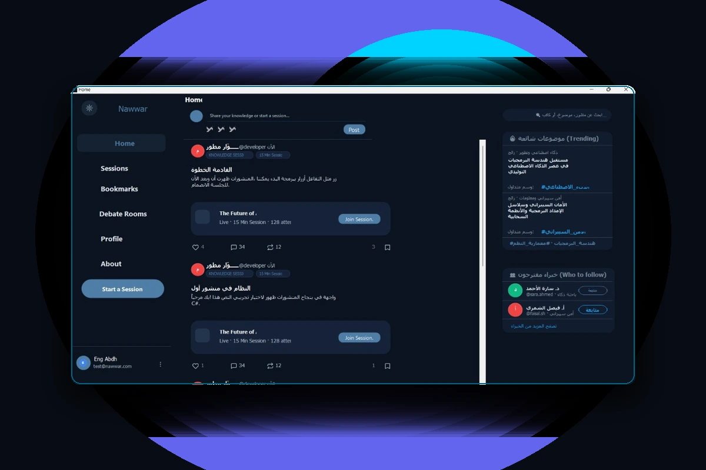
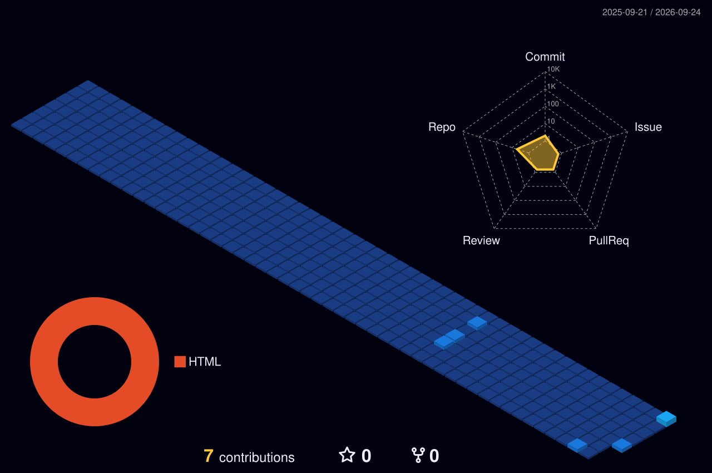

<!-- Bespoke High-Resolution Vector Hero Banner -->

 

<!-- Realtime Typing Tagline -->
[+%7C+Flutter;Designing+High-Throughput+APIs+%26+Distributed+Systems;PostgreSQL+%E2%80%A2+Redis+%E2%80%A2+Docker+DevOps+%E2%80%A2+Linux;Engineering+Scalable+Solutions+From+Concept+to+Production)](https://github.com/eng-abdulhmeed)

 

<!-- Verified Badges -->

&nbsp;

&nbsp;

&nbsp;

---

## 💻 Interactive Cyber Terminal

  

---

## 🌐 Distributed System Architecture Blueprint

> A high-level architectural view of how my production software ecosystems are structured — from client frontends and asynchronous gateway routers to microservices, in-memory caching, and relational database clusters.

---

<!-- Local Bespoke Architecture & Metrics Component (100% Reliable, Zero Downtime) -->

  

---

## 🛠️ Technical Competencies

| Domain | Technologies & Frameworks |
| :--- | :--- |
| **Languages** |       |
| **Backend & APIs** |     |
| **Frontend & Mobile** |      |
| **Databases & Cache** |    |
| **DevOps & Tooling** |      |

---

## 🚀 Featured Engineering Projects

 

### 1. 🎨 WIDD (منصة ودّ) — Interactive Greeting Cards Platform & Visual Canvas Editor
> Modern Arabic web platform enabling users to customize cards via a real-time drag-and-drop HTML5 Canvas engine with high-resolution export.

<table>
  <tr>
    <td width="48%" align="center">
      
    </td>
    <td width="52%" valign="top">
      <h4>Platform Highlights:</h4>
      <ul>
        <li><b>Backend:</b> Laravel 12 with PHP 8.3 &amp; MySQL.</li>
        <li><b>Interactive Canvas:</b> Built with <code>Fabric.js</code> supporting Arabic typography, layer management, and real-time element manipulation.</li>
        <li><b>Export Engine:</b> High-fidelity client-side and server-side PNG rendering.</li>
      </ul>
      

        <a href="https://greeting-cards.premiumasp.net/"><b>🔗 Visit Live Platform</b></a> &nbsp;|&nbsp; 
        <a href="https://greeting-cards.premiumasp.net/editor"><b>🎨 Live Canvas Editor</b></a>
      

      

        
<b>🔍 Architectural Deep Dive &amp; Engineering Solutions</b>

         
        <ul>
          <li><b>The Challenge:</b> Rendering high-resolution Canvas exports (300 DPI) and bidirectional Arabic typography directly in browser canvas without performance drops or memory leaks on mobile devices.</li>
          <li><b>Engineering Solution:</b> Engineered an optimized <code>Fabric.js</code> object lifecycle pool. Separated text rendering layers from background rasterization. Offloaded heavy image compression to asynchronous server-side queues in <b>Laravel 12</b> with thumbnail caching in <b>Redis</b>.</li>
          <li><b>Key Stack:</b> <code>Laravel 12</code> • <code>PHP 8.3</code> • <code>Fabric.js</code> • <code>MySQL</code> • <code>Redis</code>.</li>
        </ul>
      

    </td>
  </tr>
</table>

 

### 2. 🤖 TomNum Bot — Telegram Virtual Number Marketplace
> Asynchronous Telegram bot service automating activation number sales, balance management, and SMS verification hooks.

<table>
  <tr>
    <td width="48%" align="center">
      
    </td>
    <td width="52%" valign="top">
      <h4>System Architecture:</h4>
      <ul>
        <li><b>Core:</b> Python 3.12 with <code>aiogram 3.x</code> utilizing asynchronous dispatchers and middlewares.</li>
        <li><b>Persistence &amp; Cache:</b> PostgreSQL for financial transactions + Redis for state &amp; webhook caching.</li>
        <li><b>Payments &amp; Deployment:</b> Cryptomus crypto gateway + Dockerized container pipeline.</li>
      </ul>
      

        <a href="https://github.com/eng-abdulhmeed/telegram-bot"><b>💻 GitHub Repository</b></a> &nbsp;|&nbsp; 
        <a href="https://t.me/TomNumbot"><b>⚡ Test Bot (@TomNumbot)</b></a>
      

      

        
<b>🔍 Architectural Deep Dive &amp; Engineering Solutions</b>

         
        <ul>
          <li><b>The Challenge:</b> Ensuring zero race conditions and sub-second response times under burst loads of incoming Telegram webhook updates while awaiting real-time SMS arrival and cryptocurrency confirmation.</li>
          <li><b>Engineering Solution:</b> Architected an asynchronous event-driven system with <b>Python 3.12</b> and <b>aiogram 3</b>. Integrated <b>Redis</b> as an in-memory finite state machine (FSM) to handle concurrent user sessions. Transactions are strictly isolated within <b>PostgreSQL</b> ACID boundaries. Orchestrated through <b>Docker</b> containers with auto-recovery health checks.</li>
          <li><b>Key Stack:</b> <code>Python 3.12</code> • <code>aiogram 3.x</code> • <code>PostgreSQL</code> • <code>Redis</code> • <code>Docker</code> • <code>Cryptomus API</code>.</li>
        </ul>
      

    </td>
  </tr>
</table>

 

### 3. 📚 Nawwar (نوّر) — Knowledge Social Platform
> Multi-tier web platform for collaborative academic sharing, featuring custom dashboards and user authorization.

<table>
  <tr>
    <td width="48%" align="center">
      
    </td>
    <td width="52%" valign="top">
      <h4>Key Highlights:</h4>
      <ul>
        <li><b>Architecture:</b> Modular MVC structure with dedicated administrative analytics dashboard.</li>
        <li><b>Capabilities:</b> Role-based access control (RBAC), content indexing, and responsive UI.</li>
      </ul>
      

        <a href="https://github.com/eng-abdulhmeed/MyProjectNawwar"><b>💻 GitHub Repository</b></a> &nbsp;|&nbsp; 
        <a href="https://eng-abdulhmeed.github.io/me/"><b>🌐 Case Study in Portfolio</b></a>
      

      

        
<b>🔍 Architectural Deep Dive &amp; Engineering Solutions</b>

         
        <ul>
          <li><b>The Challenge:</b> Designing a scalable multi-role permissions matrix (students, educators, admins) with real-time academic resource streaming and metrics tracking.</li>
          <li><b>Engineering Solution:</b> Implemented a clean decoupled MVC pattern with Role-Based Access Control (RBAC) middleware, dynamic analytical queries, and a modern responsive interface.</li>
          <li><b>Key Stack:</b> <code>Full-Stack</code> • <code>RESTful APIs</code> • <code>Relational DB</code> • <code>Bootstrap 5</code>.</li>
        </ul>
      

    </td>
  </tr>
</table>

---

## 📈 Engineering Activity, 3D Isometric City & Contribution Snake

<!-- 3D Isometric Contribution City (Rendered Daily by GitHub Actions) -->
<picture>
  <source media="(prefers-color-scheme: dark)" srcset="./profile-3d-contrib/profile-night-view.svg" />
  <source media="(prefers-color-scheme: light)" srcset="./profile-3d-contrib/profile-green-animate.svg" />
  
</picture>

  

<!-- Live Animated Contribution Snake -->
<picture>
  <source media="(prefers-color-scheme: dark)" srcset="https://raw.githubusercontent.com/eng-abdulhmeed/eng-abdulhmeed/output/github-contribution-grid-snake-dark.svg" />
  <source media="(prefers-color-scheme: light)" srcset="https://raw.githubusercontent.com/eng-abdulhmeed/eng-abdulhmeed/output/github-contribution-grid-snake.svg" />
  
</picture>

  

<!-- Verified High-Speed Demolab Streak Stats -->

---

## 📬 Connect & Collaborate

&nbsp;

&nbsp;

&nbsp;

&nbsp;

&nbsp;
[-090d16?style=for-the-badge&logo=x&logoColor=00F0FF)](https://x.com/eng_abdulhmeed)

 

*💡 Available for full-time engineering roles, high-impact consulting, and distributed systems architecture.*

---

  Designed with precision for <b>Eng. Abdulhmeed Abo-Hatem</b> • Powered by GitHub

